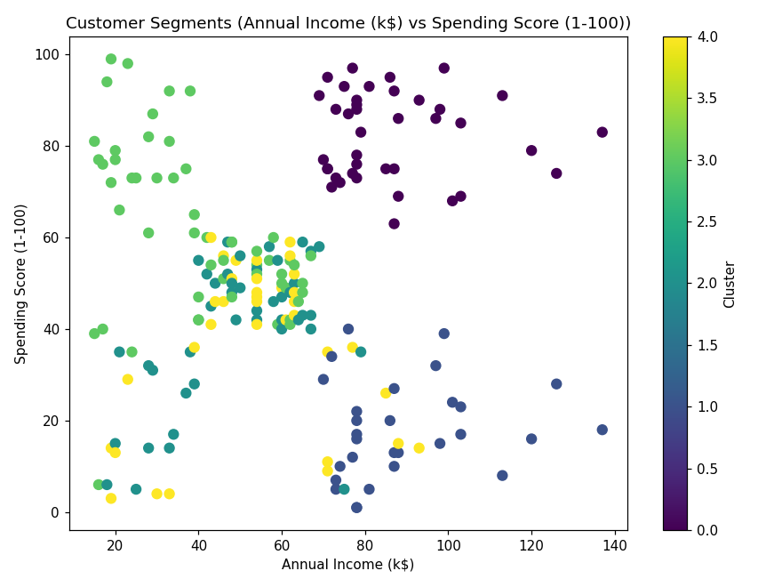
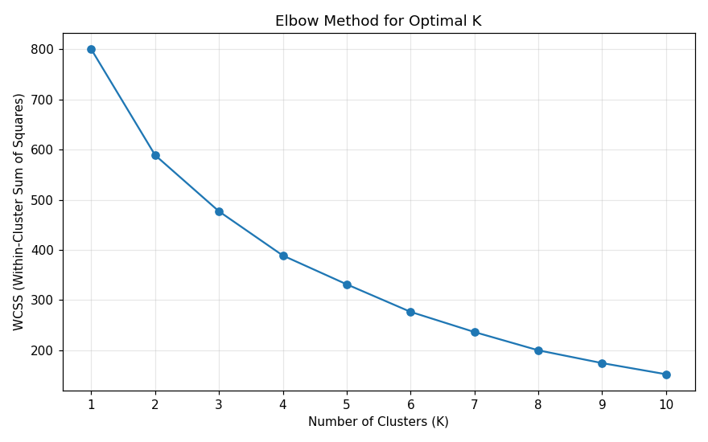
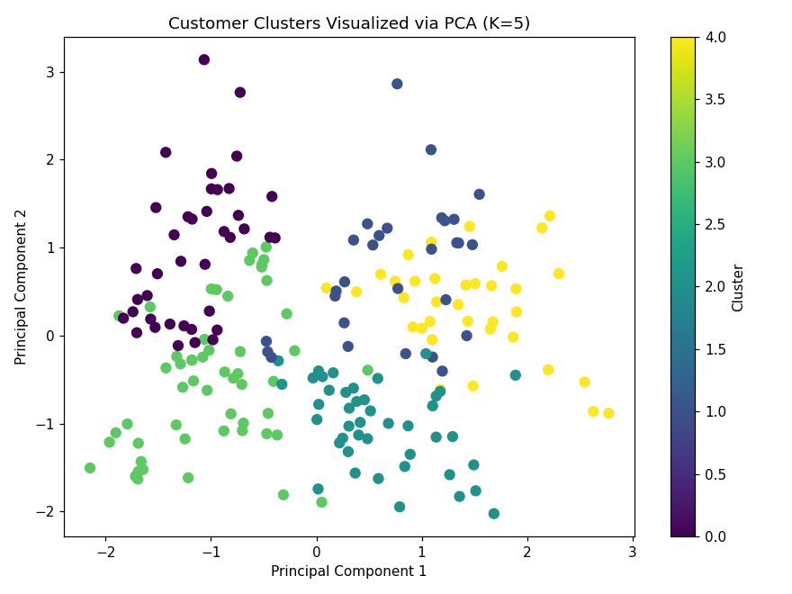

# Assignment 7 — Customer Segmentation using K-Means Clustering and PCA

## Objective
A shopping mall wants to divide its customers into groups based on their annual income and spending behavior, to support targeted marketing campaigns. This project uses **K-Means Clustering** to segment customers and **Principal Component Analysis (PCA)** to visualize those segments in two dimensions.

## Dataset Link
Mall Customer Segmentation Dataset (Kaggle):
https://www.kaggle.com/datasets/vjchoudhary7/customer-segmentation-tutorial-in-python

*(Dataset is **not** redistributed in this repository per the assignment instructions. Download `Mall_Customers.csv` from the Kaggle link above and place it in the project folder — or point `DATA_PATH` in the code at wherever you saved it.)*

## Libraries Used
- `pandas` — data loading and exploration
- `numpy` — numerical operations
- `scikit-learn` — `StandardScaler`, `LabelEncoder`, `KMeans`, `PCA`
- `matplotlib` — visualization (elbow curve, cluster scatter, PCA plot)

## Methodology
1. **Data Understanding** — Loaded the dataset (200 records, 5 columns), identified `Age`, `Annual Income (k$)`, and `Spending Score (1-100)` as numerical features and `Gender` as the only categorical feature, and reviewed dataset info and summary statistics.
2. **Data Preprocessing**
   - Confirmed there were no missing values across all 200 records.
   - Dropped `CustomerID` (a non-predictive identifier).
   - Encoded `Gender` with `LabelEncoder`.
   - Standardized all features (`Gender`, `Age`, `Annual Income (k$)`, `Spending Score (1-100)`) with `StandardScaler`.
3. **Model Development**
   - Ran the **Elbow Method** across K = 1–10 and selected **K = 5** based on where the WCSS curve's rate of decrease clearly flattens.
   - Trained the final `KMeans` model with K = 5.
   - Assigned a cluster label to every customer.
   - Applied `PCA` to reduce the standardized features to 2 principal components for visualization.
4. **Visualization and Evaluation** — Plotted the elbow curve, a scatter of clusters over Annual Income vs. Spending Score, a 2D PCA scatter colored by cluster, and a per-cluster feature-mean profile table.
5. **Conclusion** — Summarized findings, business applications, one K-Means limitation, and one PCA advantage.

## Results

**Elbow Method (WCSS by K):**

| K | 1 | 2 | 3 | 4 | 5 | 6 | 7 | 8 | 9 | 10 |
|---|---|---|---|---|---|---|---|---|---|---|
| WCSS | 800.00 | 588.80 | 476.79 | 388.72 | 331.31 | 276.41 | 236.20 | 199.75 | 174.24 | 152.03 |

The rate of decrease slows noticeably after **K = 5**, which is the chosen number of clusters.

**Cluster sizes (K = 5):**

| Cluster | Size |
|---|---|
| 0 | 39 |
| 1 | 29 |
| 2 | 43 |
| 3 | 54 |
| 4 | 35 |

**PCA:** the 2 principal components together explain **≈59.9%** of total variance (PC1 ≈ 33.7%, PC2 ≈ 26.2%).

**Cluster profiles (mean values):**

| Cluster | Age | Annual Income (k$) | Spending Score | Profile |
|---|---|---|---|---|
| 0 | 32.7 | 86.5 | 82.1 | Young, high income, high spending — **"Target" premium shoppers** |
| 1 | 36.5 | 89.5 | 18.0 | Mid-age, high income, low spending — **"Careful" high earners** |
| 2 | 49.8 | 49.2 | 40.1 | Older, mid income, mid spending — **"Standard" customers** |
| 3 | 24.9 | 39.7 | 61.2 | Young, lower income, high spending — **"Careless" spenders** |
| 4 | 55.7 | 53.7 | 36.8 | Older, mid income, low spending — **"Sensible" customers** |

--------------------

----------------------------

---------------------

## Observations
1. **Optimal number of clusters:** the elbow curve shows WCSS dropping sharply up to K = 5, after which each additional cluster buys a much smaller reduction — K = 5 is the clear elbow point.
2. **How PCA helps:** with 4 standardized features feeding K-Means, the data can't be plotted directly. PCA compresses it into 2 components capturing ~60% of the total variance, making it possible to see the 5 clusters separated on a single 2D scatter plot even though the clustering itself happened in the original 4D feature space.
3. **Cluster characteristics:** the segments split cleanly along an income/spending trade-off — young high-income high-spenders (Cluster 0) and young lower-income high-spenders (Cluster 3) both spend freely but come from very different income brackets, while high-income low-spenders (Cluster 1) represent an underexploited group for marketing.
4. Cluster 3 (young, lower income, high spending) is the largest segment (54 customers), suggesting the mall's current customer base skews toward younger, spending-driven shoppers rather than premium high-income customers.

## Conclusion
This project segmented 200 mall customers into 5 groups using K-Means clustering on age, income, spending score, and gender, with the optimal K chosen from a clear elbow at K = 5. The segments ranged from young, high-income, high-spending "target" customers to high-income customers who spend very little, revealing distinct behavioral patterns rather than income alone driving spending.

These segments give the mall a practical basis for targeted marketing: premium loyalty offers for high-spend segments, re-engagement campaigns for high-income/low-spend customers, and value-driven promotions for younger, lower-income but high-spending groups.

A key limitation of K-Means is that it requires the number of clusters to be chosen in advance and assumes roughly spherical, similarly-sized clusters, which may not always reflect real customer behavior. PCA's main advantage here is that it let us visualize and validate the otherwise 4-dimensional clustering result in an interpretable 2D plot, at the cost of only some (about 40%) of the total variance.

## Files in this Repository
- `Assignment-7.ipynb` — full notebook with code, outputs, and plots
- `Assignment-7.py` — equivalent standalone Python script
- `elbow_curve.png` — WCSS vs. K elbow curve
- `cluster_scatter.png` — Annual Income vs. Spending Score, colored by cluster
- `pca_cluster_visualization.png` — 2D PCA scatter, colored by cluster
- `README.md` — this file

> `Mall_Customers.csv` is intentionally **not** included in this repository per the submission instructions (dataset license). Download it from the Kaggle link above before running the code.
